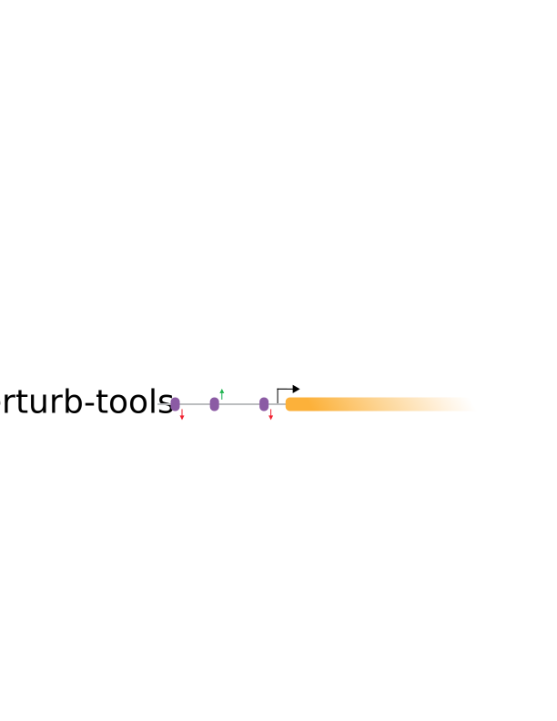
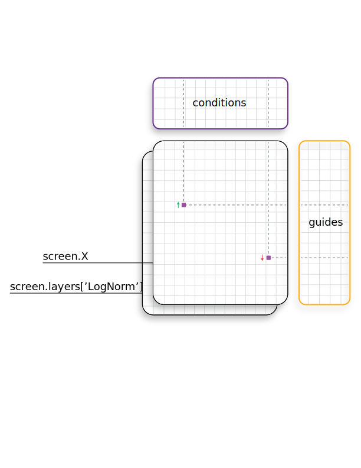

# 

[](https://pypi.python.org/pypi/perturb-tools/)
[](https://badge.fury.io/py/perturb-tools)
[](https://github.com/psf/black)

**perturb-tools** is an **analysis framework for pooled CRISPR genome-editing screens**. Thus far, development has focused on local (i.e., not genome-wide) tiling screens with specific phenotypic readouts though expansion of this scope is of interest. 


## Data Structure and Analysis Framework

```python
import perturb_tools as pt

screen = pt.Screen(X)
```
```
Genome Editing Screen composed of: n_guides x n_conditions = 946 x 12

   guides:    'barcode', 'barcode_id', 'experiment', 'sequence', 'target_id', 'pred_ABE_edit', 'pred_CBE_edit'
   condit:    'conditions'
   condit_m:  'barcode_counts', 'unexpected_sequences'
   condit_p:  'correlation'
   layers:    'X_lognorm'
   uns:       'run_info', 'poolq3', 'metadata', 'SampleBarcodeReadCounts', 'CommonSampleBarcodeReadCounts'
```

This format and organization of metadata surrounding a multidimensional experiment is inspired by [AnnData](https://anndata.readthedocs.io/en/stable/), a useful solution for the analogous organization of single-cell data.
<br></br>


### The three main components of this data strcuture:

* **`screen.X`** (Numpy array)

* **`screen.condit`** (pandas DataFrame) of shape: `[conditions x condition_annotation]`

* **`screen.guides`** (pandas DataFrame) of shape: `[guides x guide_annotation]`

See [API tutorial](perturb_tools/_framework/README.md) for more information.


## Installation

**Install the development package**:
```BASH
# (1) clone this repository
git clone https://github.com/pinellolab/perturb-tools.git

# (2) install the local project in editable mode
cd ./perturb-tools; pip install -e .
```

## General analysis Steps
* [**API tutorial**](perturb_tools/_framework/README.md)
* [**Normalization**](perturb_tools/_normalization/README.md)
* [**Arithmetic**](perturb_tools/_arithmetic/README.md)
   * Calculating the mean, standard deviation, and log-fold change between/across replicates
   * Correlation calculation
* **Hit discovery** (under development)
* **Visualization** (under development)

### Items under consideration:
1. Sequence prediction of targeted base-edit
2. TF motif annotation

   a. Occupancy of Cas9 for CRISPRi (and how this may disrupt a TF motif)
   
   b. Putative creation / destruction of TF motifs upon predicted base-editing outcome
