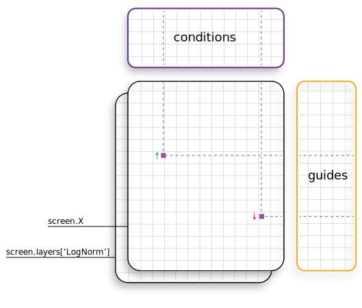

# 

[](https://pypi.python.org/pypi/perturb-tools/)
[](https://badge.fury.io/py/perturb-tools)
[](https://github.com/psf/black)

## Analysis Framework for Pooled CRISPR Genome Editing Screens

```python
import perturb_tools as pt

screen = pt.Screen(X)
```
```
Genome Editing Screen composed of: n_guides x n_conditions = 946 x 12

   guides:    'barcode', 'barcode_id', 'experiment', 'sequence', 'target_id', 'pred_ABE_edit', 'pred_CBE_edit'
   condit:    'conditions'
   condit_m:  'barcode_counts', 'unexpected_sequences'
   condit_p:  'correlation'
   layers:    'X_lognorm'
   uns:       'run_info', 'poolq3', 'metadata', 'SampleBarcodeReadCounts', 'CommonSampleBarcodeReadCounts'
```


## Data Structure
This format and organization of metadata surrounding a multidimensional experiment is inspired by [AnnData](https://anndata.readthedocs.io/en/stable/), a useful solution for the analogous organization of single-cell data.
<br></br>

